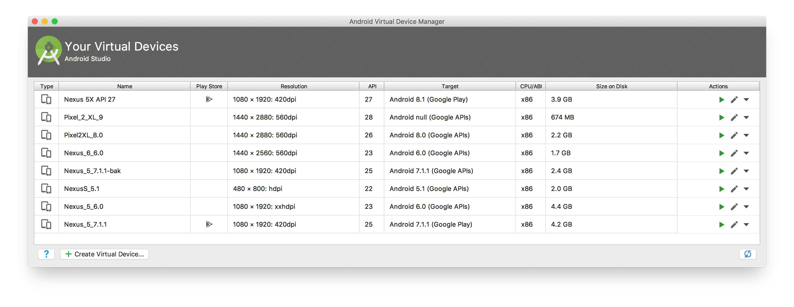

# Setting up Android on a local machine

## Android
To use this boilerplate on a local machine for Android, emulator(s) need to be available.
To setup your local machine you should download Android Studio, see for instructions [here](https://developer.android.com/studio/).

Follow the instructions to download and setup Android studio and configure a your emulators with [this](https://developer.android.com/studio/run/managing-avds) tutorial.

Please use Google to find the correct instructions to setup your environment (Windows / Mac / Linux).

### Start the emulator
If you were able to create emulators you can use the following options to start the emulators

- From Android Studio itself through:
    - Open `Tools > AVD Manager`
    
    
    
    - Select your emulator and click on the `play`-button
    
    
    
- From the command line with the default Android commands, see [this](https://developer.android.com/studio/run/emulator-commandline) link
- Use a module called `start-android-emulator` which can be found [here](https://github.com/wswebcreation/start-android-emulator)

> It is advised to keep an emulator open and start tests against an already opened emulator to speed up tests. Starting an emulator manually/by Appium is time consuming and will slow down the test execution.